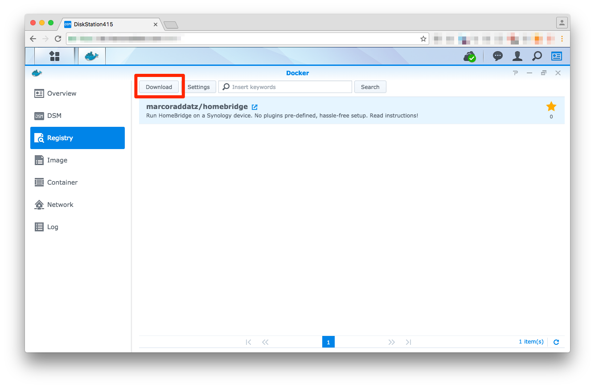
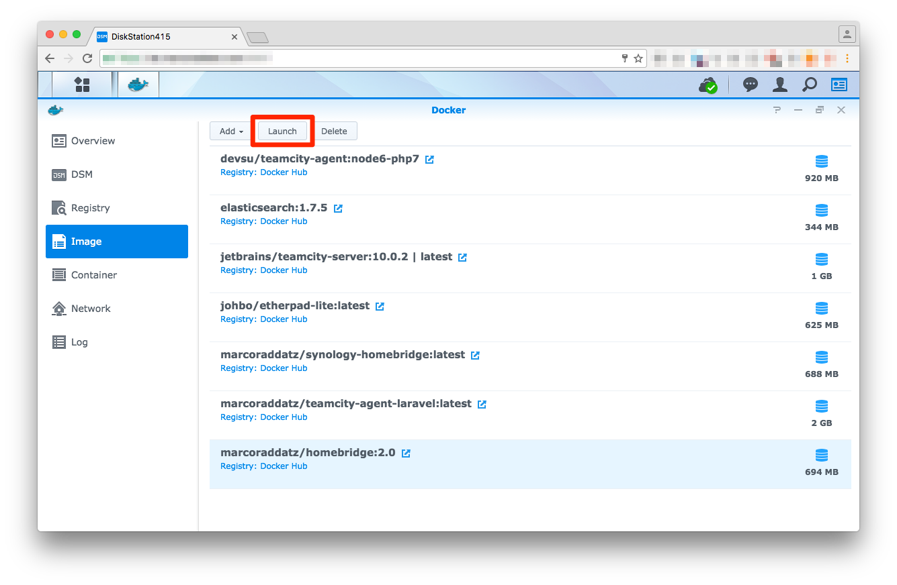
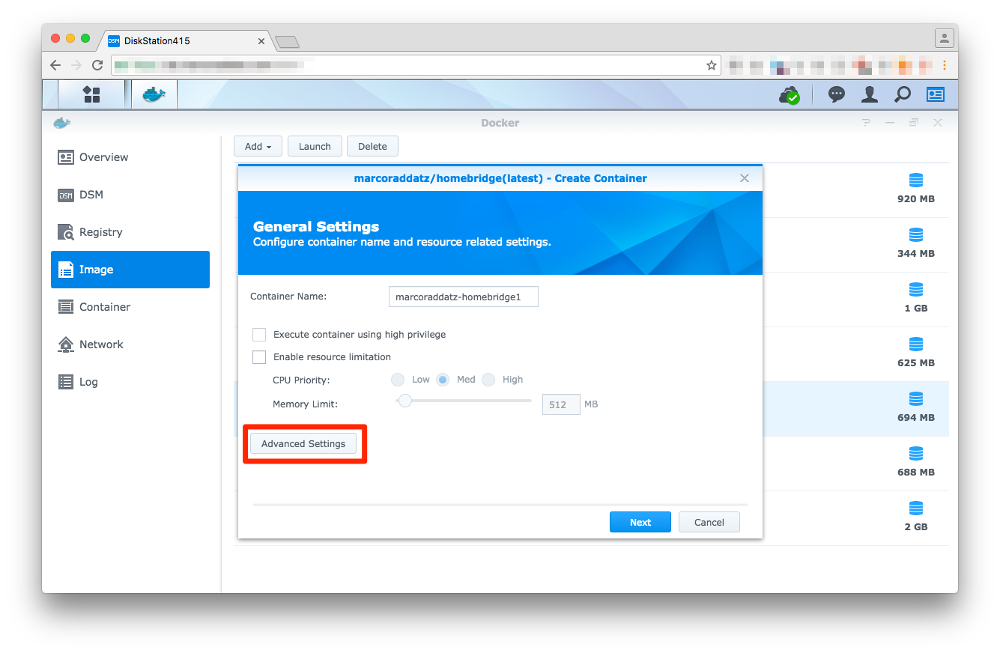
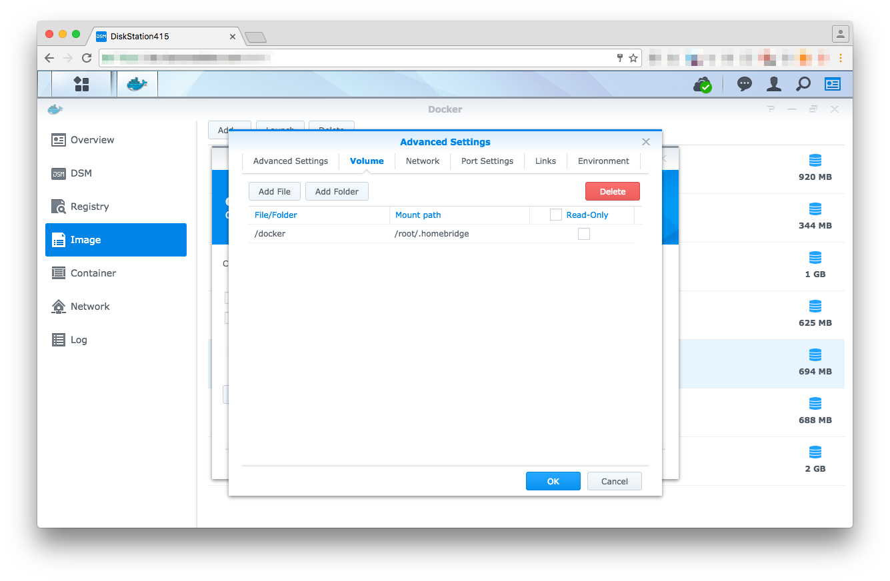
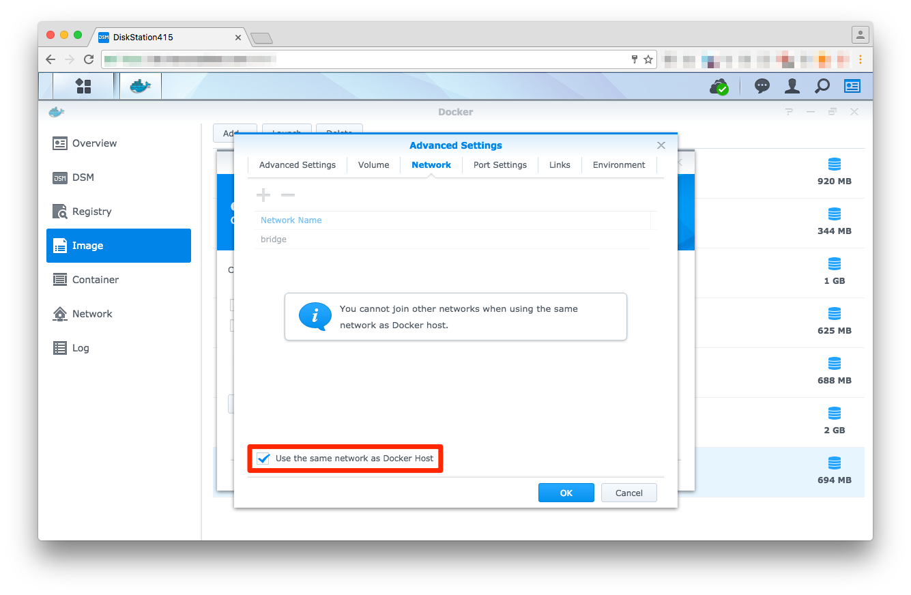
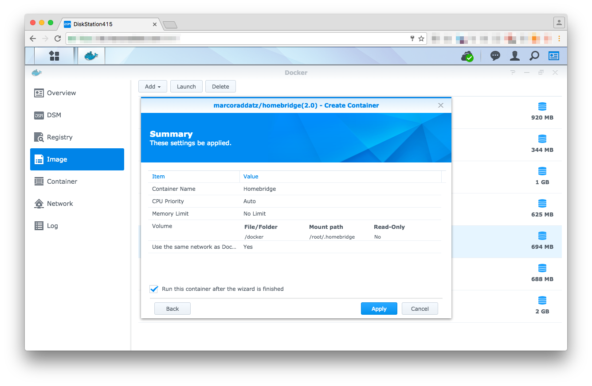

# HomeBridge on Synology

[This Docker image](https://hub.docker.com/r/marcoraddatz/homebridge/) helps you to easily setup [HomeBridge](https://github.com/nfarina/homebridge) on your Synology. Make sure you run at least DSM 6.0.2, otherwise you [might have to go the harder way](https://marcoraddatz.com/en/2016/07/13/run-homebridge-on-a-synology/) via SSH.

## Synology

### 1. Download Image

First of all, login to your Synology DSM, open Docker and install `marcoraddatz/homebridge` from within the registry.



### 2. Prepare your scripts

Create a dir at `/volume1/docker/homebridge` and put your `config.json` and **either** your `package.json` or `install.sh` in there. Here are two examples of how your setup can look like:

#### package.json

```json
{
  "name": "DiskStationHomeBridge",
  "description": "HomeKit support for the impatient.",
  "version": "0.1.1",
  "license": "ISC",
  "dependencies": {
    "homebridge-harmonyhub": "0.2.0-alpha",
    "homebridge-netatmo": "^0.0.4",
    "homebridge-nukiio": "^0.0.3",
    "homebridge-synology": "^0.1.0"
  }
}
```

#### install.sh

```shell
#!/bin/sh

npm install -g homebridge-harmonyhub
npm install -g homebridge-netatmo
npm install -g homebridge-nukiio
npm install -g homebridge-synology
```


A third option is to place your plugins manually under `/volume1/docker/homebridge/plugins`. Homebridge will then load them automatically.

### 3. Start Container

After our plugins are set up, we’re now ready to launch the Docker container.







Link the `/volume1/docker/homebridge` to `/root/.homebridge`, otherwise, the configuration files won’t be loaded. Make sure you don’t click "read only".



It's very important to select the *Use the same network as Docker Host* checkbox.



Once you launch the container, everything will be installed in the back. If an error occurs, you can use the container's log (Container → Details → Log) to find out the reason why.

## Command line

There are multiple commands that you can run on the `homebridge.sh` script. Please have a look at that file, it should be self-explaining.

## License

The original project from Chris Brandlehner is licensed under Apache License V2 (see LICENSE). Changes are licensed under MIT.

## Thanks
- [Chris Brandlehner](https://github.com/cbrandlehner/homebridge-docker)
- [Parker Smith](https://github.com/psmith3/synology-docker-homebridge)
- Christian Haugen