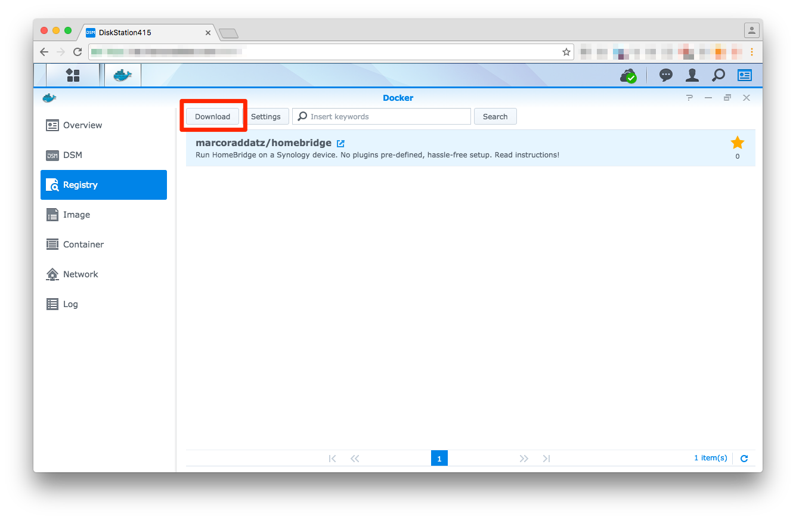
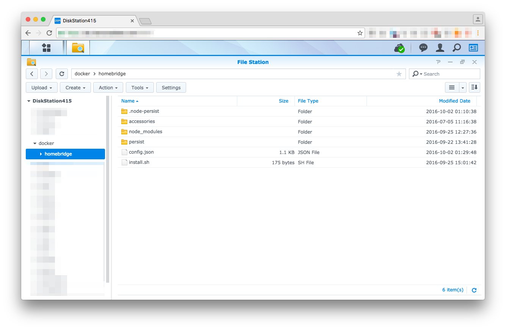
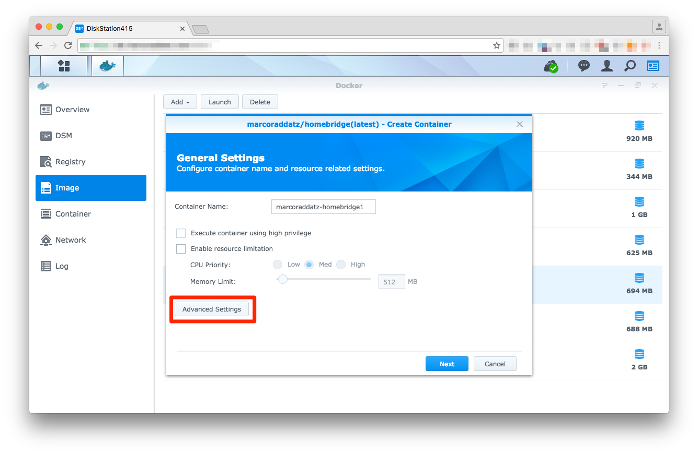
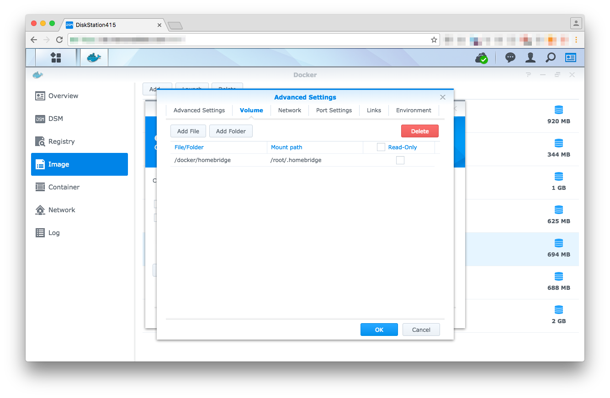
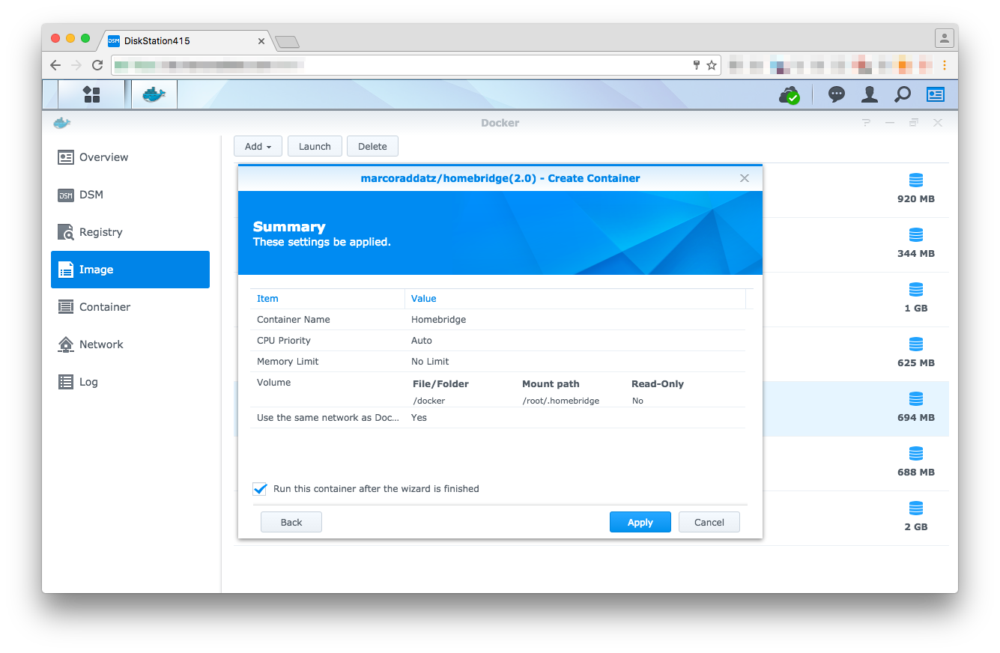

# Homebridge on Synology

[This Docker image](https://hub.docker.com/r/marcoraddatz/homebridge/) helps you to easily setup [Homebridge](https://github.com/nfarina/homebridge) on your Synology. Make sure you run at least DSM 6.0.2, otherwise you [might have to go the harder way](https://marcoraddatz.com/en/2016/07/13/run-homebridge-on-a-synology/) via SSH / shell scripts.

> If you're on Docker Hub right now and don't see any images, you might want to read this page on [Github](https://github.com/marcoraddatz/homebridge-docker).

## Synology

### 1. Download Image

First of all, login to your Synology DSM, open Docker, and download `marcoraddatz/homebridge` from within the registry.



### 2. Prepare your scripts

Create a folder at `/volume1/docker/homebridge` and put your `config.json` and **either** your `package.json` or `install.sh` in there. 

If you're using the DSM File Station, create the folder in the virtual root.



Here are two examples of how your setup files can look like:

#### package.json

```json
{
  "name": "DiskStationHomeBridge",
  "description": "HomeKit support for the impatient.",
  "version": "0.1.1",
  "license": "ISC",
  "dependencies": {
    "homebridge-harmonyhub": "0.2.0-alpha",
    "homebridge-netatmo": "^0.0.4",
    "homebridge-nukiio": "^0.0.3",
    "homebridge-synology": "^0.1.0"
  }
}
```

#### install.sh

```shell
#!/bin/sh

npm install -g homebridge-harmonyhub
npm install -g homebridge-netatmo
npm install -g homebridge-nukiio
npm install -g homebridge-synology
```


A third option is to place your plugins manually under `/volume1/docker/homebridge/plugins`. This is especially useful if you intend to write an own plugin. See the [Homebridge docs](https://github.com/nfarina/homebridge#plugin-development) for details.

### 3. Start Container

After your plugins are configured, you're now ready to launch the Docker container.






Link the `/volume1/docker/homebridge` to `/root/.homebridge`, otherwise, the configuration files won’t be loaded (within DSM the path is only shown as `/docker/homebridge`. Make sure you don’t click "read only".


It's very important to select the *Use the same network as Docker Host* checkbox.



Once you launch the container, Homebridge and all its dependencies will be installed. To verify that Homebridge is running or if an error occurs, you can use the container's log (Container → Details → Log) to find out the reason why.

## Command line

There are many Docker commands that can be run via the `homebridge.sh` script. Please have a look [at the file](homebridge.sh), it should be self-explaining.

## License

The [original project from Patrick Busch](https://github.com/patrickbusch/homebridge-docker) is licensed under Apache License V2 (see [LICENSE](LICENSE)). Changes are under MIT.

## Thanks
- [Chris Brandlehner](https://github.com/cbrandlehner/homebridge-docker)
- [Parker Smith](https://github.com/psmith3/synology-docker-homebridge)
- Christian Haugen